# Data Driven Gait Analysis

### TRA105 Digitalization in Sports

#### Group Members:
 - David Larsson [larsdav@student.chalmers.se]
 - Savya Sachi Gupta [savya@student.chalmers.se]
 
 ---
 ---
 
 In this notebook, we will be looking at two methods we employed to build models to identify 'Gait' in skiers, i.e., Random Forest Classifier and Multiclass Logistic Regression. Each of these methods will be trained on a set of skier data and validated using skiers data that has not been used to train or tune the model. Further details regarding the setup of these experiments has been provided in their respective sections. Please note that this notebook focuses on only the implementation of classification models and their performance on data. Any information regarding the raw data, pre-processing of raw data, cleaning, preparation etc can be found within the files present in the `functions` folder of this package.
 
 ## Instructions:
  - Please ensure that all packages/libraries/dependencies are installed on your system
  - Two user defined libraries are present in the 'functions' folder of this package which are accessed by the first two lines of the importing libraries module. If you are unable to access them via the folder, you may copy and paste both the files in the same directory as this notebook and edit the import command accordingly to simply reflect the filenames
  - Under the 'Loading the Dataset' code block, you will see `path_first` and `path_second` that point to the raw skier data that we want to load. Please ensure that these paths exist on your system and their relative filepath as specified in the variables are functioning for you.
  - **Note**: The following are the user defined functions that have been used in this notebook:
      - from `functions.dataframe_functions`:
         - `get_dataframe` : function to load all skier data into this notebook. It also shifts the data by 12 seconds to align the data more accurately
      - from `functions.analysis_setup_functions`:
         - `split_train_test_data` : function to split skier data into train and validation datasets. Randomly selects `validation_skiers = 3` to randomly select 3 skiers from the entire list to consider as validation data and the remaining as training data.
         - `tune_random_forest` : Function to perform hyperparameter tuning for a random forest classifier model
         - `tune_logistic_regression` : Function to perform hyperparameter tuning for a multiclass logistic regression model
         - `evaluate` : Function to predict labels for the validation data. Performs 5-fold cross-validation and returns confusion matrix, classifier performance metrics. It is a generic function and is used for both random forest and logistic regression. 
         - `plot_predicted_gear_comparison` : plots the true labels of the validation data as a line plot and superimposes a scatterplot with the predicted labels to visually show the accuracy of the model in classifying the gears. We have the Gear Numbers on the y-axis and No. of observations on the x-axis.

**You can understand more about these functions by reading through their files where they have been defined and explained in detail**


##### Importing Libraries


```python
from functions.dataframe_functions import *
from functions.analysis_setup_functions import *

from IPython.display import HTML
import pandas as pd
import numpy as np
import random as rnd
from sklearn.preprocessing import StandardScaler
import matplotlib.pyplot as plt
import seaborn as sns
from sklearn.model_selection import train_test_split
from collections import Counter
from sklearn.ensemble import RandomForestClassifier
from pprint import pprint
from sklearn.model_selection import RandomizedSearchCV
from sklearn.model_selection import GridSearchCV
from sklearn.feature_selection import SelectFromModel
from sklearn.model_selection import cross_val_score, cross_val_predict
from sklearn.metrics import classification_report, confusion_matrix
from sklearn.linear_model import LogisticRegression, LogisticRegressionCV
from sklearn.model_selection import KFold
from sklearn import metrics
```

##### Loading the Dataset

We load the entire dataset of all the skiers together, so that we can later split into trianing and test according to our convenience. If you want to change the number of skiers that should be chosen for validation, please change the `validation_skiers` variable to a number of your choice. We have set it to 3. `df_info` is the dataframe which contains all the information useful for running our model and that is the one used by us in this notebook.


```python
path_first = "../matlab_report-master/Treadmill/Test/Torsby/"
skier_list = [1, 2, 3, 4, 5, 6, 7, 8, 9, 10]
path_second = "/CSV/csvData.csv"
filepath_list = [path_first + str(i) + path_second for i in skier_list]

main_df, df_peaks, df_info = get_dataframe(filepath_list, skier_list)

# No. of Skiers to use for testing
validation_skiers = 3
```

---
---
---
# RANDOM FOREST CLASSIFIER
---

Now that we have our data loaded from the above code block, we will see how well a random forest classifier method performs in identifying the gears. The execution of our experiment using random forest classifier will be carried out in the following steps:
 - Load training and validation data based on randomly selected skiers
 - Perform hyperparameter tuning for a random forest classifier model on this dataset
 - Evaluate the validation data using the tuned model and return performance metrics for this model
 - Plot the predicted and True gears of validation data to visualize quality of predictions made
 - Store all results
 - **Repeat all the above steps again**
 
The experiment is performed within the `for` loop which is used to repeat the experiments for 5 runs (in our case). We will then view the results across all the runs and see if the performance of this method is consistent, and share our observations.


```python
# Create a dataframe that will store data for every run in one table
rfc_results_df = pd.DataFrame(columns=list(['Training Skiers','Validation Skiers','Best Hyperparameters',
                                           'Accuracy','Balanced Accuracy','MCC','F1 (Macro Avg)','Classifier Score',
                                           'Classification Report']))

for i in range(0,5):

    #Load training and validation data based on randomly selected skiers
    X_train, X_valid, y_train, y_valid, y_plot_data, train_skiers_list, val_skiers_list = split_train_test_data(df_info, skier_list, validation_skiers)
    
    display(HTML(f'<p><strong><span style="font-size: 24px; color: rgb(0, 168, 133);">Case {i+1} : Training Skiers : {train_skiers_list}  ||  Validation Skiers : {val_skiers_list}</span></strong></p>'))
    
    # Perform hyperparameter tuning for a random forest classifier model on this dataset
    rfc, rfc_best_params = tune_random_forest(X_train, y_train)

    # Evaluate the model using validation data and output performance metrics
    results, all_y_pred, CM_arr, class_report = evaluate(rfc,X_valid, y_valid, 'Random Forest Classifier')
    
    # Plot the predicted and True gears of validation data to visualize quality of predictions made
    plot_predicted_gear_comparison(y_plot_data,all_y_pred,False)
    
    # Store all results
    temp_all_metrics =  ["" for x in range(9)]
    temp_all_metrics[0] = train_skiers_list
    temp_all_metrics[1] = val_skiers_list
    temp_all_metrics[2] = rfc_best_params
    temp_all_metrics[3] = results[0]
    temp_all_metrics[4] = results[1]
    temp_all_metrics[5] = results[5]
    temp_all_metrics[6] = results[4]
    temp_all_metrics[7] = results[9]
    temp_all_metrics[8] = class_report
    
    rfc_results_df.loc[len(rfc_results_df)] = temp_all_metrics
    
    print('\n\n')
```

    
    Randomly Splitting Skiers into Training and Validation Sets...
    Training Skiers : [1, 2, 5, 6, 7, 8, 9]
    Validation Skiers : [4, 3, 10]
    


<p><strong><span style="font-size: 24px; color: rgb(0, 168, 133);">Case 1 : Training Skiers : [1, 2, 5, 6, 7, 8, 9]  ||  Validation Skiers : [4, 3, 10]</span></strong></p>


    Performing Hyperparameter Tuning...
    
    Best Parameters after Randomized Search CV : 
    {'n_estimators': 97, 'min_samples_split': 2, 'min_samples_leaf': 6, 'max_depth': 40, 'class_weight': 'balanced_subsample', 'bootstrap': True}
    
    
    Evaluating Validation Data with 5-fold CV...
    
    


    
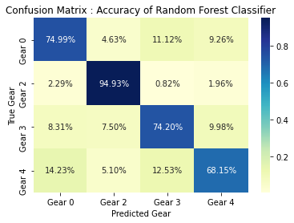
    


    Performance Metrics for Random Forest Classifier :
    ----------------------------------------------------------
    Accuracy Score: 0.765
    Balanced Accuracy Score: 0.781
    MCC Score: 0.668
    F-1 Score (Macro Avg): 0.735
    Classifier Score: 0.644
    
    Classification Report: 
                   precision    recall  f1-score   support
    
               0       0.84      0.75      0.79      1771
               2       0.70      0.95      0.80       611
               3       0.85      0.74      0.79      1973
               4       0.46      0.68      0.55       471
    
        accuracy                           0.77      4826
       macro avg       0.71      0.78      0.73      4826
    weighted avg       0.79      0.77      0.77      4826
    
    


    
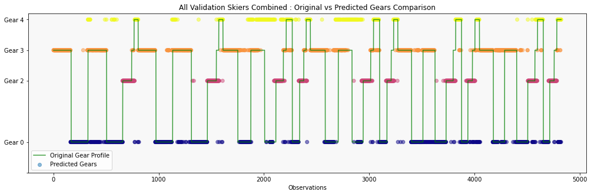
    


    
    
    
    
    Randomly Splitting Skiers into Training and Validation Sets...
    Training Skiers : [1, 2, 3, 5, 6, 8, 9]
    Validation Skiers : [10, 7, 4]
    


<p><strong><span style="font-size: 24px; color: rgb(0, 168, 133);">Case 2 : Training Skiers : [1, 2, 3, 5, 6, 8, 9]  ||  Validation Skiers : [10, 7, 4]</span></strong></p>


    Performing Hyperparameter Tuning...
    
    Best Parameters after Randomized Search CV : 
    {'n_estimators': 51, 'min_samples_split': 2, 'min_samples_leaf': 6, 'max_depth': 40, 'class_weight': 'balanced_subsample', 'bootstrap': True}
    
    
    Evaluating Validation Data with 5-fold CV...
    
    


    
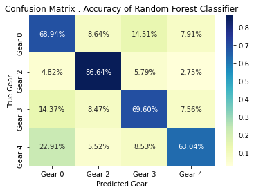
    


    Performance Metrics for Random Forest Classifier :
    ----------------------------------------------------------
    Accuracy Score: 0.711
    Balanced Accuracy Score: 0.721
    MCC Score: 0.595
    F-1 Score (Macro Avg): 0.695
    Classifier Score: 0.554
    
    Classification Report: 
                   precision    recall  f1-score   support
    
               0       0.74      0.69      0.71      1771
               2       0.65      0.87      0.74       726
               3       0.79      0.70      0.74      1865
               4       0.56      0.63      0.59       598
    
        accuracy                           0.71      4960
       macro avg       0.68      0.72      0.70      4960
    weighted avg       0.72      0.71      0.71      4960
    
    


    
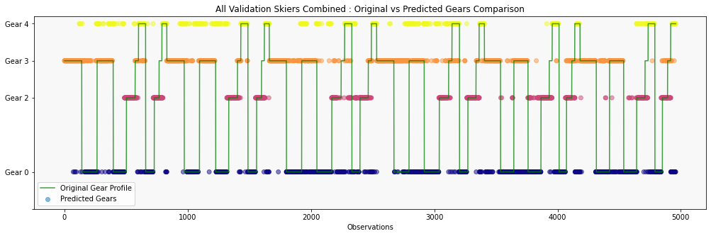
    


    
    
    
    
    Randomly Splitting Skiers into Training and Validation Sets...
    Training Skiers : [1, 3, 4, 5, 7, 8, 10]
    Validation Skiers : [6, 9, 2]
    


<p><strong><span style="font-size: 24px; color: rgb(0, 168, 133);">Case 3 : Training Skiers : [1, 3, 4, 5, 7, 8, 10]  ||  Validation Skiers : [6, 9, 2]</span></strong></p>


    Performing Hyperparameter Tuning...
    
    Best Parameters after Randomized Search CV : 
    {'n_estimators': 51, 'min_samples_split': 4, 'min_samples_leaf': 6, 'max_depth': 60, 'class_weight': 'balanced_subsample', 'bootstrap': False}
    
    
    Evaluating Validation Data with 5-fold CV...
    
    


    
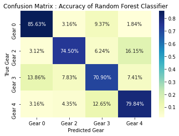
    


    Performance Metrics for Random Forest Classifier :
    ----------------------------------------------------------
    Accuracy Score: 0.775
    Balanced Accuracy Score: 0.777
    MCC Score: 0.664
    F-1 Score (Macro Avg): 0.713
    Classifier Score: 0.7
    
    Classification Report: 
                   precision    recall  f1-score   support
    
               0       0.83      0.86      0.84      1900
               2       0.63      0.74      0.68       545
               3       0.86      0.71      0.78      2172
               4       0.42      0.80      0.55       253
    
        accuracy                           0.78      4870
       macro avg       0.68      0.78      0.71      4870
    weighted avg       0.80      0.78      0.78      4870
    
    


    
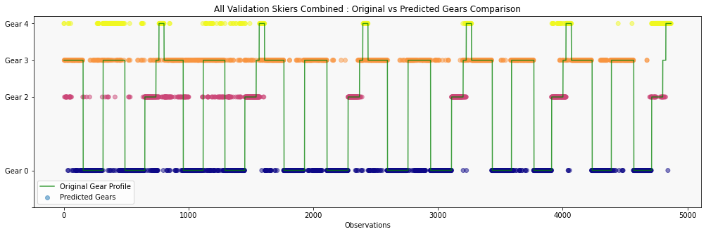
    


    
    
    
    
    Randomly Splitting Skiers into Training and Validation Sets...
    Training Skiers : [1, 2, 4, 5, 6, 8, 10]
    Validation Skiers : [7, 9, 3]
    


<p><strong><span style="font-size: 24px; color: rgb(0, 168, 133);">Case 4 : Training Skiers : [1, 2, 4, 5, 6, 8, 10]  ||  Validation Skiers : [7, 9, 3]</span></strong></p>


    Performing Hyperparameter Tuning...
    
    Best Parameters after Randomized Search CV : 
    {'n_estimators': 74, 'min_samples_split': 4, 'min_samples_leaf': 6, 'max_depth': 30, 'class_weight': 'balanced', 'bootstrap': True}
    
    
    Evaluating Validation Data with 5-fold CV...
    
    


    
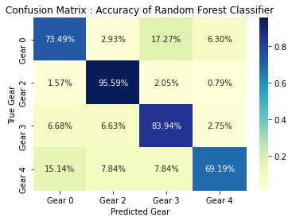
    


    Performance Metrics for Random Forest Classifier :
    ----------------------------------------------------------
    Accuracy Score: 0.805
    Balanced Accuracy Score: 0.806
    MCC Score: 0.712
    F-1 Score (Macro Avg): 0.774
    Classifier Score: 0.719
    
    Classification Report: 
                   precision    recall  f1-score   support
    
               0       0.87      0.73      0.80      1841
               2       0.73      0.96      0.83       635
               3       0.83      0.84      0.84      2111
               4       0.59      0.69      0.64       370
    
        accuracy                           0.80      4957
       macro avg       0.75      0.81      0.77      4957
    weighted avg       0.81      0.80      0.80      4957
    
    


    
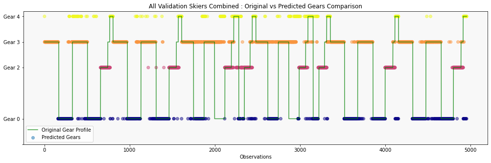
    


    
    
    
    
    Randomly Splitting Skiers into Training and Validation Sets...
    Training Skiers : [2, 4, 5, 6, 8, 9, 10]
    Validation Skiers : [7, 1, 3]
    


<p><strong><span style="font-size: 24px; color: rgb(0, 168, 133);">Case 5 : Training Skiers : [2, 4, 5, 6, 8, 9, 10]  ||  Validation Skiers : [7, 1, 3]</span></strong></p>


    Performing Hyperparameter Tuning...
    
    Best Parameters after Randomized Search CV : 
    {'n_estimators': 74, 'min_samples_split': 2, 'min_samples_leaf': 6, 'max_depth': 10, 'class_weight': 'balanced', 'bootstrap': False}
    
    
    Evaluating Validation Data with 5-fold CV...
    
    


    
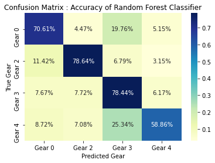
    


    Performance Metrics for Random Forest Classifier :
    ----------------------------------------------------------
    Accuracy Score: 0.741
    Balanced Accuracy Score: 0.716
    MCC Score: 0.615
    F-1 Score (Macro Avg): 0.693
    Classifier Score: 0.596
    
    Classification Report: 
                   precision    recall  f1-score   support
    
               0       0.83      0.71      0.76      1766
               2       0.64      0.79      0.71       604
               3       0.77      0.78      0.78      2073
               4       0.48      0.59      0.53       367
    
        accuracy                           0.74      4810
       macro avg       0.68      0.72      0.69      4810
    weighted avg       0.75      0.74      0.74      4810
    
    


    
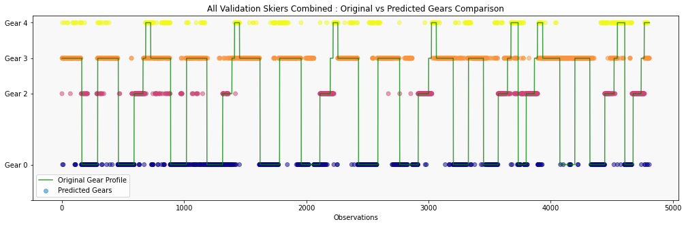
    


    
    
    
    

## Summary of RFC Model Across 5 Runs


```python
rfc_results_df
```


<div>
<style scoped>
    .dataframe tbody tr th:only-of-type {
        vertical-align: middle;
    }

    .dataframe tbody tr th {
        vertical-align: top;
    }

    .dataframe thead th {
        text-align: right;
    }
</style>
<table border="1" class="dataframe">
  <thead>
    <tr style="text-align: right;">
      <th></th>
      <th>Training Skiers</th>
      <th>Validation Skiers</th>
      <th>Best Hyperparameters</th>
      <th>Accuracy</th>
      <th>Balanced Accuracy</th>
      <th>MCC</th>
      <th>F1 (Macro Avg)</th>
      <th>Classifier Score</th>
      <th>Classification Report</th>
    </tr>
  </thead>
  <tbody>
    <tr>
      <th>0</th>
      <td>[1, 2, 5, 6, 7, 8, 9]</td>
      <td>[4, 3, 10]</td>
      <td>{'n_estimators': 97, 'min_samples_split': 2, '...</td>
      <td>0.765</td>
      <td>0.781</td>
      <td>0.668</td>
      <td>0.735</td>
      <td>0.644</td>
      <td>precision    recall  f1-score   ...</td>
    </tr>
    <tr>
      <th>1</th>
      <td>[1, 2, 3, 5, 6, 8, 9]</td>
      <td>[10, 7, 4]</td>
      <td>{'n_estimators': 51, 'min_samples_split': 2, '...</td>
      <td>0.711</td>
      <td>0.721</td>
      <td>0.595</td>
      <td>0.695</td>
      <td>0.554</td>
      <td>precision    recall  f1-score   ...</td>
    </tr>
    <tr>
      <th>2</th>
      <td>[1, 3, 4, 5, 7, 8, 10]</td>
      <td>[6, 9, 2]</td>
      <td>{'n_estimators': 51, 'min_samples_split': 4, '...</td>
      <td>0.775</td>
      <td>0.777</td>
      <td>0.664</td>
      <td>0.713</td>
      <td>0.700</td>
      <td>precision    recall  f1-score   ...</td>
    </tr>
    <tr>
      <th>3</th>
      <td>[1, 2, 4, 5, 6, 8, 10]</td>
      <td>[7, 9, 3]</td>
      <td>{'n_estimators': 74, 'min_samples_split': 4, '...</td>
      <td>0.805</td>
      <td>0.806</td>
      <td>0.712</td>
      <td>0.774</td>
      <td>0.719</td>
      <td>precision    recall  f1-score   ...</td>
    </tr>
    <tr>
      <th>4</th>
      <td>[2, 4, 5, 6, 8, 9, 10]</td>
      <td>[7, 1, 3]</td>
      <td>{'n_estimators': 74, 'min_samples_split': 2, '...</td>
      <td>0.741</td>
      <td>0.716</td>
      <td>0.615</td>
      <td>0.693</td>
      <td>0.596</td>
      <td>precision    recall  f1-score   ...</td>
    </tr>
  </tbody>
</table>
</div>


```python
rfc_results_df.describe()
```


<div>
<style scoped>
    .dataframe tbody tr th:only-of-type {
        vertical-align: middle;
    }

    .dataframe tbody tr th {
        vertical-align: top;
    }

    .dataframe thead th {
        text-align: right;
    }
</style>
<table border="1" class="dataframe">
  <thead>
    <tr style="text-align: right;">
      <th></th>
      <th>Accuracy</th>
      <th>Balanced Accuracy</th>
      <th>MCC</th>
      <th>F1 (Macro Avg)</th>
      <th>Classifier Score</th>
    </tr>
  </thead>
  <tbody>
    <tr>
      <th>count</th>
      <td>5.00000</td>
      <td>5.000000</td>
      <td>5.000000</td>
      <td>5.00000</td>
      <td>5.000000</td>
    </tr>
    <tr>
      <th>mean</th>
      <td>0.75940</td>
      <td>0.760200</td>
      <td>0.650800</td>
      <td>0.72200</td>
      <td>0.642600</td>
    </tr>
    <tr>
      <th>std</th>
      <td>0.03548</td>
      <td>0.039695</td>
      <td>0.046397</td>
      <td>0.03363</td>
      <td>0.069201</td>
    </tr>
    <tr>
      <th>min</th>
      <td>0.71100</td>
      <td>0.716000</td>
      <td>0.595000</td>
      <td>0.69300</td>
      <td>0.554000</td>
    </tr>
    <tr>
      <th>25%</th>
      <td>0.74100</td>
      <td>0.721000</td>
      <td>0.615000</td>
      <td>0.69500</td>
      <td>0.596000</td>
    </tr>
    <tr>
      <th>50%</th>
      <td>0.76500</td>
      <td>0.777000</td>
      <td>0.664000</td>
      <td>0.71300</td>
      <td>0.644000</td>
    </tr>
    <tr>
      <th>75%</th>
      <td>0.77500</td>
      <td>0.781000</td>
      <td>0.668000</td>
      <td>0.73500</td>
      <td>0.700000</td>
    </tr>
    <tr>
      <th>max</th>
      <td>0.80500</td>
      <td>0.806000</td>
      <td>0.712000</td>
      <td>0.77400</td>
      <td>0.719000</td>
    </tr>
  </tbody>
</table>
</div>


## Observations

As we can see, the Random Forest Classifier performs well in predicting the gears across all runs on the validation dataset. Across 5 runs, we get a Mean Accuracy of **`0.759`** and a Mean Balanced Accuracy of **`0.760`** with a Mean MCC Score of **`0.650`** which indicates that this is potentially a good classifier for our data. 

Even though the performance of our models in each of the runs varied between 0.7 and 0.8, we have tested this method on different combinations of training and validation sets and can thus be fairly confident that it would perform similarly with somehwat similar performance metrics for any new data we test it on. 

In each of the cases, prediction of Gear 4 was poor followed by Gear 2 (in some cases), even though it had high accuracy, it had the lowest precision among all the gears consistently. This could be due to the fact that they have a considerably smaller set of values in our dataset so the model cannot learn more information about it, and balancing the class weights does not completely rectify the same. 

---
---
---
# Multiclass Logistic Regression
---
In this section, we will see how well multiclass logistic regression performs in identifying the gears. The execution of our experiment using this method will be carried out in the following steps, similar to the random forest method:
 - Load training and validation data based on randomly selected skiers
 - Perform hyperparameter tuning for a multiclass logistic regression model on this dataset
 - Evaluate the validation data using the tuned model and return performance metrics for this model
 - Plot the predicted and True gears of validation data to visualize quality of predictions made
 - Store all results
 - **Repeat all the above steps again**
 
The experiment is performed within the `for` loop which is used to repeat the experiments for 5 runs (in our case). We will then view the results across all the runs and see if the performance of this method is consistent, and share our observations.


```python
# # Create a dataframe that will store data for every run in one table
lr_results_df = pd.DataFrame(columns=list(['Training Skiers','Validation Skiers','Best Hyperparameters',
                                           'Accuracy','Balanced Accuracy','MCC','F1 (Macro Avg)','Classifier Score',
                                           'Classification Report']))

for i in range(0,5):

    # Load training and validation data based on randomly selected skiers
    X_train, X_valid, y_train, y_valid, y_plot_data, train_skiers_list, val_skiers_list = split_train_test_data(df_info, skier_list, validation_skiers)
    
    display(HTML(f'<p><strong><span style="font-size: 24px; color: rgb(0, 168, 133);">Case {i+1} : Training Skiers : {train_skiers_list}  ||  Validation Skiers : {val_skiers_list}</span></strong></p>'))
    
    # Perform hyperparameter tuning for a multiclass logistic regression model on this dataset
    lr, lr_best_params = tune_logistic_regression(X_train, y_train)

    # Evaluate the model using validation data and output performance metrics
    results, all_y_pred, CM_arr, class_report = evaluate(lr, X_valid, y_valid, 'Multiclass Logistic Regression')

    # Plot the predicted and True gears of validation data to visualize quality of predictions made
    plot_predicted_gear_comparison(y_plot_data,all_y_pred,False)
    
    # Store all results
    temp_all_metrics =  ["" for x in range(9)]
    temp_all_metrics[0] = train_skiers_list
    temp_all_metrics[1] = val_skiers_list
    temp_all_metrics[2] = lr_best_params
    temp_all_metrics[3] = results[0]
    temp_all_metrics[4] = results[1]
    temp_all_metrics[5] = results[5]
    temp_all_metrics[6] = results[4]
    temp_all_metrics[7] = results[9]
    temp_all_metrics[8] = class_report
    
    lr_results_df.loc[len(lr_results_df)] = temp_all_metrics
    
    print('\n\n')
```

    
    Randomly Splitting Skiers into Training and Validation Sets...
    Training Skiers : [2, 4, 6, 7, 8, 9, 10]
    Validation Skiers : [1, 3, 5]
    


<p><strong><span style="font-size: 24px; color: rgb(0, 168, 133);">Case 1 : Training Skiers : [2, 4, 6, 7, 8, 9, 10]  ||  Validation Skiers : [1, 3, 5]</span></strong></p>


    Performing Hyperparameter Tuning...
    
    Best Parameters after Randomized Search CV : 
    {'solver': 'sag', 'penalty': 'l2', 'max_iter': 5200, 'dual': False, 'class_weight': 'balanced', 'C': 61.0540229658533}
    
    
    Evaluating Validation Data with 5-fold CV...
    
    


    
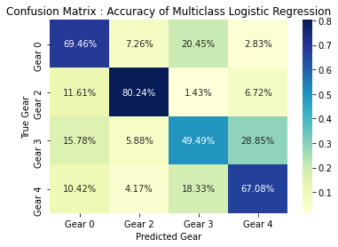
    


    Performance Metrics for Multiclass Logistic Regression :
    ----------------------------------------------------------
    Accuracy Score: 0.613
    Balanced Accuracy Score: 0.666
    MCC Score: 0.456
    F-1 Score (Macro Avg): 0.571
    Classifier Score: 0.596
    
    Classification Report: 
                   precision    recall  f1-score   support
    
               0       0.75      0.69      0.72      1804
               2       0.60      0.80      0.68       491
               3       0.72      0.49      0.59      2142
               4       0.19      0.67      0.29       240
    
        accuracy                           0.61      4677
       macro avg       0.56      0.67      0.57      4677
    weighted avg       0.69      0.61      0.63      4677
    
    


    
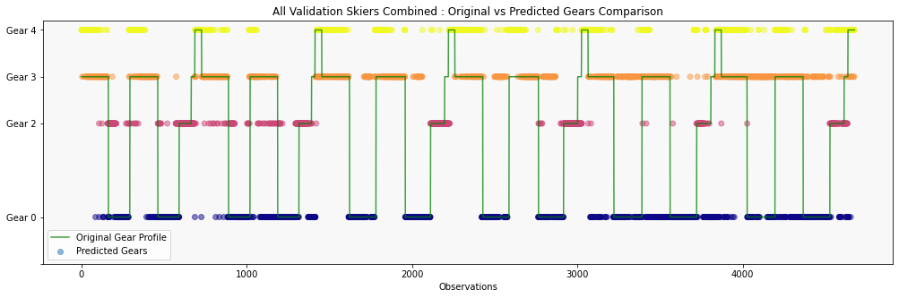
    


    
    
    
    
    Randomly Splitting Skiers into Training and Validation Sets...
    Training Skiers : [2, 4, 5, 6, 8, 9, 10]
    Validation Skiers : [3, 1, 7]
    


<p><strong><span style="font-size: 24px; color: rgb(0, 168, 133);">Case 2 : Training Skiers : [2, 4, 5, 6, 8, 9, 10]  ||  Validation Skiers : [3, 1, 7]</span></strong></p>


    Performing Hyperparameter Tuning...
    
    Best Parameters after Randomized Search CV : 
    {'solver': 'sag', 'penalty': 'l2', 'max_iter': 5300, 'dual': False, 'class_weight': 'balanced', 'C': 5.179474679231212}
    
    
    Evaluating Validation Data with 5-fold CV...
    
    


    
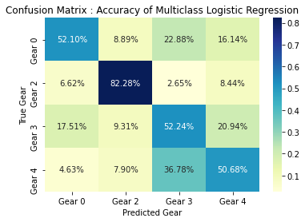
    


    Performance Metrics for Multiclass Logistic Regression :
    ----------------------------------------------------------
    Accuracy Score: 0.558
    Balanced Accuracy Score: 0.593
    MCC Score: 0.391
    F-1 Score (Macro Avg): 0.532
    Classifier Score: 0.608
    
    Classification Report: 
                   precision    recall  f1-score   support
    
               0       0.69      0.52      0.59      1766
               2       0.57      0.82      0.67       604
               3       0.66      0.52      0.58      2073
               4       0.19      0.51      0.28       367
    
        accuracy                           0.56      4810
       macro avg       0.53      0.59      0.53      4810
    weighted avg       0.62      0.56      0.57      4810
    
    


    
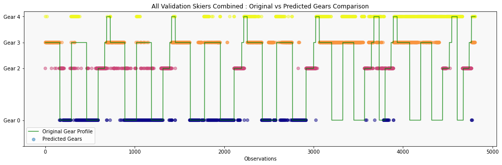
    


    
    
    
    
    Randomly Splitting Skiers into Training and Validation Sets...
    Training Skiers : [1, 2, 3, 4, 7, 9, 10]
    Validation Skiers : [5, 6, 8]
    


<p><strong><span style="font-size: 24px; color: rgb(0, 168, 133);">Case 3 : Training Skiers : [1, 2, 3, 4, 7, 9, 10]  ||  Validation Skiers : [5, 6, 8]</span></strong></p>


    Performing Hyperparameter Tuning...
    
    Best Parameters after Randomized Search CV : 
    {'solver': 'saga', 'penalty': 'l2', 'max_iter': 8600, 'dual': False, 'class_weight': 'balanced', 'C': 5.179474679231212}
    
    
    Evaluating Validation Data with 5-fold CV...
    
    


    
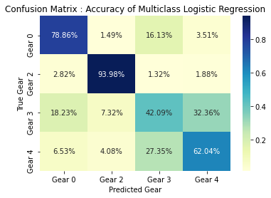
    


    Performance Metrics for Multiclass Logistic Regression :
    ----------------------------------------------------------
    Accuracy Score: 0.634
    Balanced Accuracy Score: 0.692
    MCC Score: 0.496
    F-1 Score (Macro Avg): 0.597
    Classifier Score: 0.602
    
    Classification Report: 
                   precision    recall  f1-score   support
    
               0       0.78      0.79      0.78      1878
               2       0.72      0.94      0.82       532
               3       0.70      0.42      0.53      2117
               4       0.17      0.62      0.26       245
    
        accuracy                           0.63      4772
       macro avg       0.59      0.69      0.60      4772
    weighted avg       0.71      0.63      0.65      4772
    
    


    
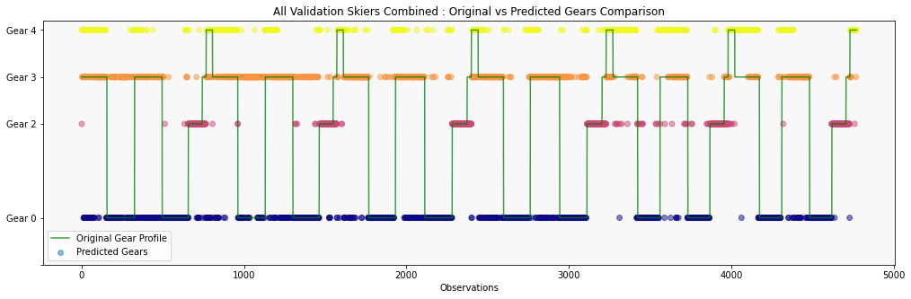
    


    
    
    
    
    Randomly Splitting Skiers into Training and Validation Sets...
    Training Skiers : [1, 2, 4, 6, 7, 8, 9]
    Validation Skiers : [10, 5, 3]
    


<p><strong><span style="font-size: 24px; color: rgb(0, 168, 133);">Case 4 : Training Skiers : [1, 2, 4, 6, 7, 8, 9]  ||  Validation Skiers : [10, 5, 3]</span></strong></p>


    Performing Hyperparameter Tuning...
    
    Best Parameters after Randomized Search CV : 
    {'solver': 'saga', 'penalty': 'l1', 'max_iter': 2000, 'dual': False, 'class_weight': 'balanced', 'C': 61.0540229658533}
    
    
    Evaluating Validation Data with 5-fold CV...
    
    

    C:\Users\savya\anaconda3\lib\site-packages\sklearn\linear_model\_sag.py:329: ConvergenceWarning: The max_iter was reached which means the coef_ did not converge
      warnings.warn("The max_iter was reached which means "
    C:\Users\savya\anaconda3\lib\site-packages\sklearn\linear_model\_sag.py:329: ConvergenceWarning: The max_iter was reached which means the coef_ did not converge
      warnings.warn("The max_iter was reached which means "
    C:\Users\savya\anaconda3\lib\site-packages\sklearn\linear_model\_sag.py:329: ConvergenceWarning: The max_iter was reached which means the coef_ did not converge
      warnings.warn("The max_iter was reached which means "
    C:\Users\savya\anaconda3\lib\site-packages\sklearn\linear_model\_sag.py:329: ConvergenceWarning: The max_iter was reached which means the coef_ did not converge
      warnings.warn("The max_iter was reached which means "
    C:\Users\savya\anaconda3\lib\site-packages\sklearn\linear_model\_sag.py:329: ConvergenceWarning: The max_iter was reached which means the coef_ did not converge
      warnings.warn("The max_iter was reached which means "
    


    
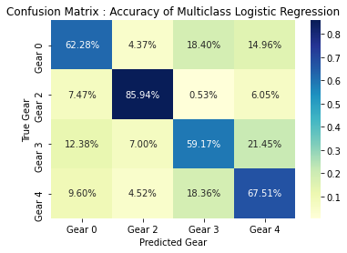
    


    Performance Metrics for Multiclass Logistic Regression :
    ----------------------------------------------------------
    Accuracy Score: 0.641
    Balanced Accuracy Score: 0.687
    MCC Score: 0.504
    F-1 Score (Macro Avg): 0.616
    Classifier Score: 0.638
    
    Classification Report: 
                   precision    recall  f1-score   support
    
               0       0.78      0.62      0.69      1832
               2       0.67      0.86      0.75       562
               3       0.75      0.59      0.66      2028
               4       0.24      0.68      0.36       354
    
        accuracy                           0.64      4776
       macro avg       0.61      0.69      0.62      4776
    weighted avg       0.71      0.64      0.66      4776
    
    


    
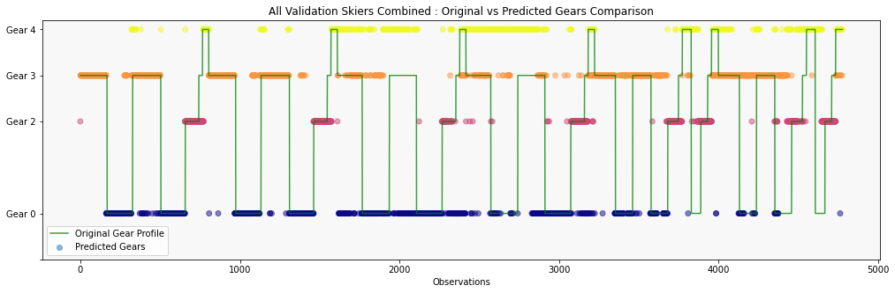
    


    
    
    
    
    Randomly Splitting Skiers into Training and Validation Sets...
    Training Skiers : [1, 2, 3, 5, 6, 7, 8]
    Validation Skiers : [4, 10, 9]
    


<p><strong><span style="font-size: 24px; color: rgb(0, 168, 133);">Case 5 : Training Skiers : [1, 2, 3, 5, 6, 7, 8]  ||  Validation Skiers : [4, 10, 9]</span></strong></p>


    Performing Hyperparameter Tuning...
    
    Best Parameters after Randomized Search CV : 
    {'solver': 'saga', 'penalty': 'l2', 'max_iter': 1800, 'dual': False, 'class_weight': 'balanced', 'C': 61.0540229658533}
    
    
    Evaluating Validation Data with 5-fold CV...
    
    

    C:\Users\savya\anaconda3\lib\site-packages\sklearn\linear_model\_sag.py:329: ConvergenceWarning: The max_iter was reached which means the coef_ did not converge
      warnings.warn("The max_iter was reached which means "
    C:\Users\savya\anaconda3\lib\site-packages\sklearn\linear_model\_sag.py:329: ConvergenceWarning: The max_iter was reached which means the coef_ did not converge
      warnings.warn("The max_iter was reached which means "
    C:\Users\savya\anaconda3\lib\site-packages\sklearn\linear_model\_sag.py:329: ConvergenceWarning: The max_iter was reached which means the coef_ did not converge
      warnings.warn("The max_iter was reached which means "
    C:\Users\savya\anaconda3\lib\site-packages\sklearn\linear_model\_sag.py:329: ConvergenceWarning: The max_iter was reached which means the coef_ did not converge
      warnings.warn("The max_iter was reached which means "
    C:\Users\savya\anaconda3\lib\site-packages\sklearn\linear_model\_sag.py:329: ConvergenceWarning: The max_iter was reached which means the coef_ did not converge
      warnings.warn("The max_iter was reached which means "
    


    
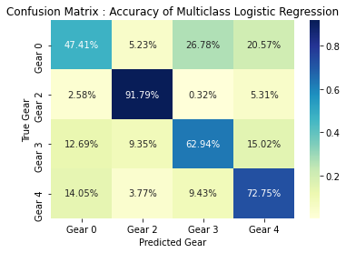
    


    Performance Metrics for Multiclass Logistic Regression :
    ----------------------------------------------------------
    Accuracy Score: 0.62
    Balanced Accuracy Score: 0.687
    MCC Score: 0.483
    F-1 Score (Macro Avg): 0.616
    Classifier Score: 0.522
    
    Classification Report: 
                   precision    recall  f1-score   support
    
               0       0.71      0.47      0.57      1740
               2       0.66      0.92      0.77       621
               3       0.71      0.63      0.67      1978
               4       0.34      0.73      0.46       477
    
        accuracy                           0.62      4816
       macro avg       0.60      0.69      0.62      4816
    weighted avg       0.67      0.62      0.62      4816
    
    


    
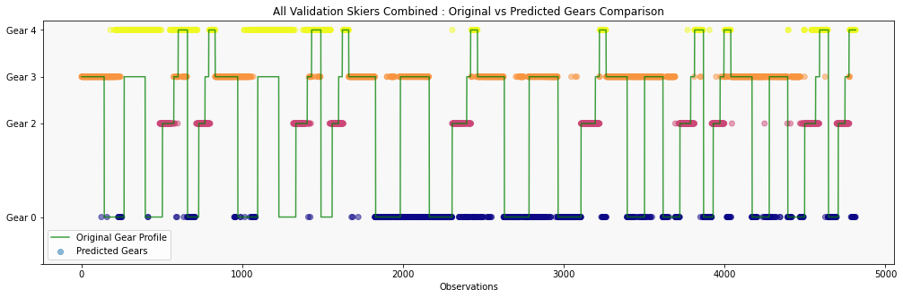
    


    
    
    
    

## Summary of Multiclass Logistic Regression over 5 Runs


```python
lr_results_df
```


<div>
<style scoped>
    .dataframe tbody tr th:only-of-type {
        vertical-align: middle;
    }

    .dataframe tbody tr th {
        vertical-align: top;
    }

    .dataframe thead th {
        text-align: right;
    }
</style>
<table border="1" class="dataframe">
  <thead>
    <tr style="text-align: right;">
      <th></th>
      <th>Training Skiers</th>
      <th>Validation Skiers</th>
      <th>Best Hyperparameters</th>
      <th>Accuracy</th>
      <th>Balanced Accuracy</th>
      <th>MCC</th>
      <th>F1 (Macro Avg)</th>
      <th>Classifier Score</th>
      <th>Classification Report</th>
    </tr>
  </thead>
  <tbody>
    <tr>
      <th>0</th>
      <td>[2, 4, 6, 7, 8, 9, 10]</td>
      <td>[1, 3, 5]</td>
      <td>{'solver': 'sag', 'penalty': 'l2', 'max_iter':...</td>
      <td>0.613</td>
      <td>0.666</td>
      <td>0.456</td>
      <td>0.571</td>
      <td>0.596</td>
      <td>precision    recall  f1-score   ...</td>
    </tr>
    <tr>
      <th>1</th>
      <td>[2, 4, 5, 6, 8, 9, 10]</td>
      <td>[3, 1, 7]</td>
      <td>{'solver': 'sag', 'penalty': 'l2', 'max_iter':...</td>
      <td>0.558</td>
      <td>0.593</td>
      <td>0.391</td>
      <td>0.532</td>
      <td>0.608</td>
      <td>precision    recall  f1-score   ...</td>
    </tr>
    <tr>
      <th>2</th>
      <td>[1, 2, 3, 4, 7, 9, 10]</td>
      <td>[5, 6, 8]</td>
      <td>{'solver': 'saga', 'penalty': 'l2', 'max_iter'...</td>
      <td>0.634</td>
      <td>0.692</td>
      <td>0.496</td>
      <td>0.597</td>
      <td>0.602</td>
      <td>precision    recall  f1-score   ...</td>
    </tr>
    <tr>
      <th>3</th>
      <td>[1, 2, 4, 6, 7, 8, 9]</td>
      <td>[10, 5, 3]</td>
      <td>{'solver': 'saga', 'penalty': 'l1', 'max_iter'...</td>
      <td>0.641</td>
      <td>0.687</td>
      <td>0.504</td>
      <td>0.616</td>
      <td>0.638</td>
      <td>precision    recall  f1-score   ...</td>
    </tr>
    <tr>
      <th>4</th>
      <td>[1, 2, 3, 5, 6, 7, 8]</td>
      <td>[4, 10, 9]</td>
      <td>{'solver': 'saga', 'penalty': 'l2', 'max_iter'...</td>
      <td>0.620</td>
      <td>0.687</td>
      <td>0.483</td>
      <td>0.616</td>
      <td>0.522</td>
      <td>precision    recall  f1-score   ...</td>
    </tr>
  </tbody>
</table>
</div>


```python
lr_results_df.describe()
```


<div>
<style scoped>
    .dataframe tbody tr th:only-of-type {
        vertical-align: middle;
    }

    .dataframe tbody tr th {
        vertical-align: top;
    }

    .dataframe thead th {
        text-align: right;
    }
</style>
<table border="1" class="dataframe">
  <thead>
    <tr style="text-align: right;">
      <th></th>
      <th>Accuracy</th>
      <th>Balanced Accuracy</th>
      <th>MCC</th>
      <th>F1 (Macro Avg)</th>
      <th>Classifier Score</th>
    </tr>
  </thead>
  <tbody>
    <tr>
      <th>count</th>
      <td>5.000000</td>
      <td>5.000000</td>
      <td>5.000000</td>
      <td>5.000000</td>
      <td>5.000000</td>
    </tr>
    <tr>
      <th>mean</th>
      <td>0.613200</td>
      <td>0.665000</td>
      <td>0.466000</td>
      <td>0.586400</td>
      <td>0.593200</td>
    </tr>
    <tr>
      <th>std</th>
      <td>0.032783</td>
      <td>0.041479</td>
      <td>0.045711</td>
      <td>0.035571</td>
      <td>0.042956</td>
    </tr>
    <tr>
      <th>min</th>
      <td>0.558000</td>
      <td>0.593000</td>
      <td>0.391000</td>
      <td>0.532000</td>
      <td>0.522000</td>
    </tr>
    <tr>
      <th>25%</th>
      <td>0.613000</td>
      <td>0.666000</td>
      <td>0.456000</td>
      <td>0.571000</td>
      <td>0.596000</td>
    </tr>
    <tr>
      <th>50%</th>
      <td>0.620000</td>
      <td>0.687000</td>
      <td>0.483000</td>
      <td>0.597000</td>
      <td>0.602000</td>
    </tr>
    <tr>
      <th>75%</th>
      <td>0.634000</td>
      <td>0.687000</td>
      <td>0.496000</td>
      <td>0.616000</td>
      <td>0.608000</td>
    </tr>
    <tr>
      <th>max</th>
      <td>0.641000</td>
      <td>0.692000</td>
      <td>0.504000</td>
      <td>0.616000</td>
      <td>0.638000</td>
    </tr>
  </tbody>
</table>
</div>


## Observations

As we can see, a Mean MCC Score of **`0.466`** and Mean accuracy of **`0.613`** make the multiclass logistic regression a poor choice in comparison to the random forest classifier method. There are still a lot of incorrectly classified gears. It could be possible that the results might improve over other combination of samples, but the long execution time, issues with convergence of solvers for large iterations and below par results do not encourage us to pursue this method further for analysis or investigation. 

---
---
---
